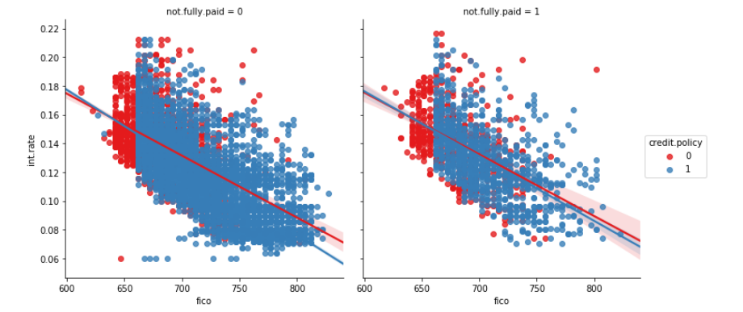

# Lending-Club-Data-Analysis

**A Decision Tree and Random Forest project**

Lending Club connects people who need money (borrowers) with people who have money (investors). Hopefully, as an investor you would want to invest in people who showed a profile of having a high probability of paying you back. We will try to create a model that will help predict this.

* We will use lending data from 2007-2010 and be trying to classify and predict whether or not the borrower paid back their loan in full

### Code Requirements

You can install Conda for python which resolves all the dependencies for machine learning.

### Here are what some of the columns represent:
* credit.policy: 1 if the customer meets the credit underwriting criteria of LendingClub.com, and 0 otherwise
* fico: The FICO credit score of the borrower.

### Execution

To run the code, use jupyter Notebook `lendingClub.ipynb`

